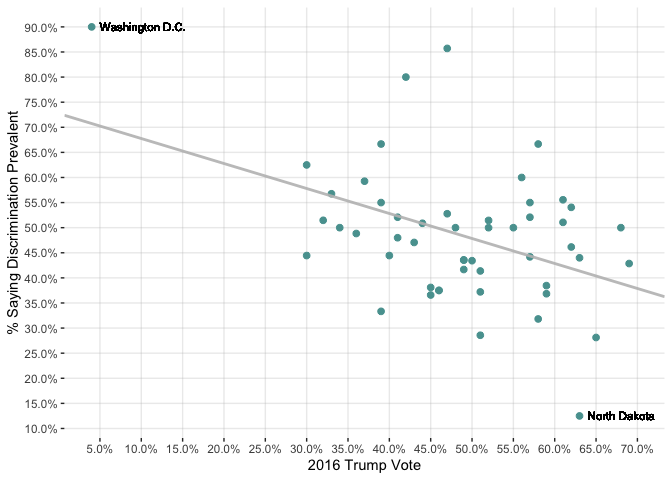

Week 4 homework assignment
================
Yufei Sun
Sept.24th, 2020

DSI-EDA
-------

Professor Cassy Dorff
---------------------

STEPS:
------

1.  Read the following article (it is for data purposes!)

NPR “CHART: The Relationship Between Seeing Discrimination And Voting
For Trump” - [link
here](https://www.npr.org/2017/08/18/544265493/chart-the-relationship-between-seeing-discrimination-and-voting-for-trump)
- [even more information on the data
here](https://www.prri.org/research/americans-views-discrimination-immigrants-blacks-lgbt-sex-marriage-immigration-reform/)

1.  Your goal is to recreate the graphic titled “Perceptions Of
    Discrimination Track Closely With Voting Against Trump.” Data for
    analysis is in the “week4-hw-data.csv” file. Note that this data is
    from a different version of the PRRI survey, and the results won’t
    match the NPR graph exactly.

2.  Graphic replication: You should:

<!-- -->

1.  Create an .rmd file to show your analysis. Write 1 sentence for each
    block of code, explaining what you do in that line of code.
2.  Identify and prepare the variables of interest (you may need to
    group, summarize, or rename variables to reflect the NPR chart.)
3.  Next recreate the graphic using ggplot. Recreate everything
    *except*:

-   the labels that are on California and Wyoming.
-   the colors (you can choose your own or use the same as the article)

1.  This means your plot should have the same labels on the axes,
    gridlines, etc.
2.  Is there anything misleading about the graphic? Why or why not?
3.  You can give your colleagues “hints” but do *not* give them the code
    for reproducing the graphic. That breaks our honor code since I
    asked you not to do it!

<!-- -->

    #answer
    library(ggplot2)
    library(scales)
    mydata <- read.csv("week4-hw-data.csv")
    head(mydata)

    ##   X state trump   discrim
    ## 1 1    AK  0.51 0.2857143
    ## 2 2    AL  0.62 0.5405405
    ## 3 3    AR  0.61 0.5555556
    ## 4 4    AZ  0.49 0.4166667
    ## 5 5    CA  0.32 0.5147059
    ## 6 6    CO  0.43 0.4705882

    class(mydata) # data frame

    ## [1] "data.frame"

    summary(mydata)

    ##        X           state               trump           discrim      
    ##  Min.   : 1.0   Length:51          Min.   :0.0400   Min.   :0.1250  
    ##  1st Qu.:13.5   Class :character   1st Qu.:0.4100   1st Qu.:0.4152  
    ##  Median :26.0   Mode  :character   Median :0.4900   Median :0.4884  
    ##  Mean   :26.0                      Mean   :0.4847   Mean   :0.4861  
    ##  3rd Qu.:38.5                      3rd Qu.:0.5750   3rd Qu.:0.5342  
    ##  Max.   :51.0                      Max.   :0.6900   Max.   :0.9000

    xx <- mydata$trump
    yy <- mydata$discrim
    p = ggplot(data = mydata, ) + geom_point(aes(x=trump, y=discrim), color = '#59A09F', size = 2)
    p = p + scale_x_continuous(labels = percent, limits=c(0.04, 0.7), breaks=round(seq(from = 0, to = 0.7, by = 0.05),2))
    p = p + scale_y_continuous(labels = percent, limits=c(0.12,0.9), breaks=round(seq(from = 0.1, to = 0.9, by = 0.05),2)) 
    p = p + labs(x="2016 Trump Vote",y="% Saying Discrimination Prevalent")
    p = p + theme(legend.position = "none", panel.background = element_rect(alpha(colour = "white", 0.1)), panel.grid.major = element_line(alpha(colour = "grey", 0.3)))
    model <- lm(mydata$discrim~mydata$trump, mydata)
    summary(model)

    ## 
    ## Call:
    ## lm(formula = mydata$discrim ~ mydata$trump, data = mydata)
    ## 
    ## Residuals:
    ##      Min       1Q   Median       3Q      Max 
    ## -0.28874 -0.06602 -0.00176  0.04815  0.36372 
    ## 
    ## Coefficients:
    ##              Estimate Std. Error t value Pr(>|t|)    
    ## (Intercept)   0.72747    0.07273  10.002    2e-13 ***
    ## mydata$trump -0.49798    0.14574  -3.417  0.00128 ** 
    ## ---
    ## Signif. codes:  0 '***' 0.001 '**' 0.01 '*' 0.05 '.' 0.1 ' ' 1
    ## 
    ## Residual standard error: 0.1237 on 49 degrees of freedom
    ## Multiple R-squared:  0.1924, Adjusted R-squared:  0.1759 
    ## F-statistic: 11.67 on 1 and 49 DF,  p-value: 0.001283

    co <- model$coefficients
    p = p + geom_abline(slope = co[2], intercept = co[1], color = "grey", size = 1, alpha = 0.9)
    idx1 <- which.max(yy)
    idx2 <- which.min(yy)
    p = p + geom_text(aes(x = xx[idx1], y = yy[idx1], label = "Washington D.C."), size=3, hjust = 0, nudge_x = 0.01)
    p = p + geom_text(aes(x = xx[idx2], y = yy[idx2], label = "North Dakota"), size=3, hjust = 0, nudge_x = 0.01)
    print(p)

<!-- -->

1.  What do you think about this graphic? Do you think this relationship
    exists? Why or why not, in your own words? The graphic above clearly
    shows the distribution of the two factors——discrimination and voting
    against Trump. I think data visualized above do not support that
    “Discrimination Track Closely With Voting Against Trump”. The
    Residual standard error of the result of linear regression is too
    small to be accepted. With naked eyes, the dots are not distributed
    in the narrow range near the regression line.

2.  Make one additional graphic of your choice using this data. Write
    3-5 sentences in clear, plain language about what the graphic
    illustrates about the data.

Part 2
------

Previously, we explored data about wine.

1.  Make a barplot with the wine data to explore our original question
    about the relationship between alcohol content and quality. Why
    might a simple bar plot be misleading here? (Read a bit about
    geom\_bar first, if needed)

<!-- -->

    #answer

1.  A lot of the hardwork in learning R skills is learning how to read
    helpfiles and use stackoverflow on your own. I showed you a glimpse
    of information about themes in class. Use the code below to make
    additional changes. This might take a bit of digging and reading
    about these graphical components online. Specifically, can you
    figure out how to (try to complete 2 out of 4):

-   get rid of panel border completely and keep the grid lines?
-   put the legend on the top or bottom?
-   capitalize the legend name appropriately?
-   add units for alcohol content and wine quality (if applicable)?

<!-- -->

    ggplot(winequality_red, aes(x=quality, y= alcohol)) +
          geom_jitter(aes(col=`fixed acidity`)) +
          scale_color_viridis(option = "D", direction = -1, alpha = .6) +
          labs(title="Alcohol Content, Fixed Acidity and Wine Quality", y="Alcohol Content", x="Wine Quality")  +
          theme_bw()

1.  Explain in 1-3 sentences what we can learn from our wine graphic
    produced in class.

Answer:
